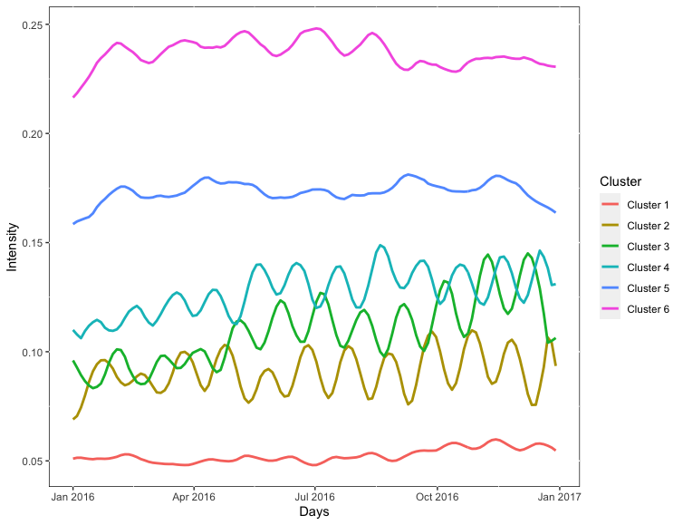

# LeoYin-Soft-Clustering-of-Functional-Point-Processes
Research Project

Project Status: working;

Introduction to the project "Semi-parametric Learning of Functional Point Process",

key words: Functional PCA; EM algorithm; GPU; array programming;
 
 ## Brief Introduction to the Project
 ### Code Description
 This code shows a GPU implementation of a joint model for temporal point processes and time-to-event outcomes through Pytorch. 
 
 ### Project Description
 
 
 
 ### Data Description
The team has access to detailed transaction records (i.e., time stamps of buying/selling stocks at the second level) of 1.2 million stock trading accounts from a national leading brokerage house in China from January 4th, 2007 to September 30th, 2009.
 
 
 ### Methodology
 
 
 
 ### Results
 The credit card customers are clustered into 6 groups, and the Figure below shows the estimated intensity functions within each cluster;
 
 
